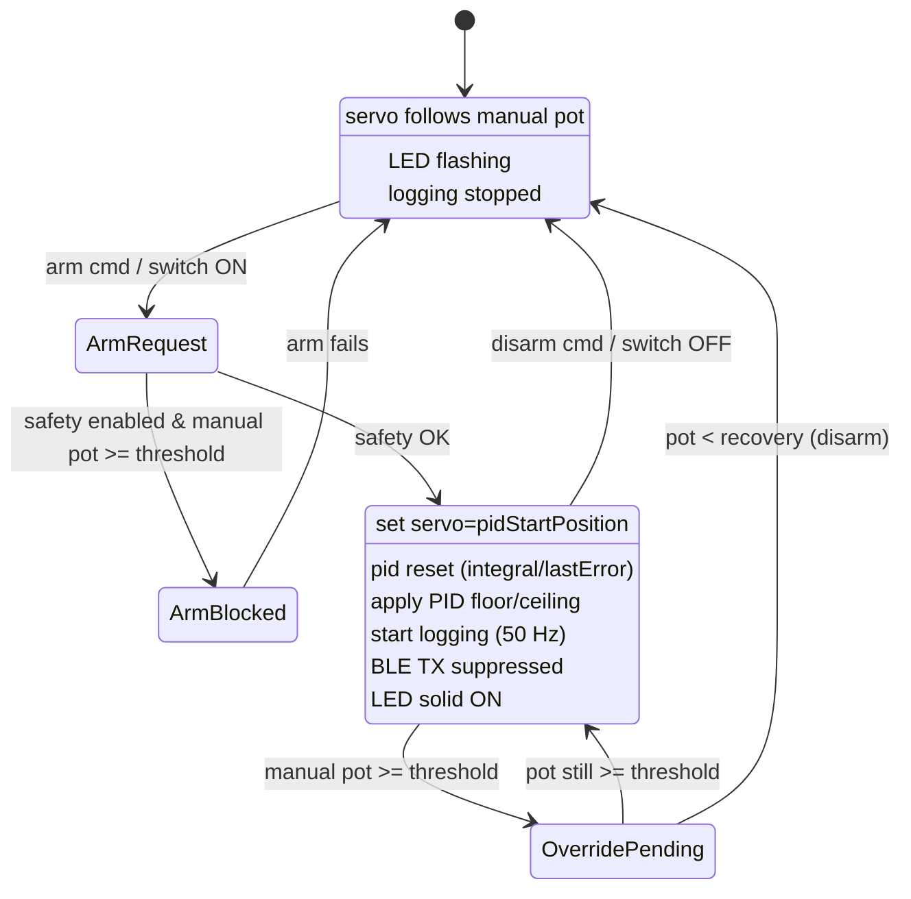

# Arm Sequence & Armed-State Flow (State Diagram)



---

# Armed Loop Timing (every 3 ms)

```mermaid
flowchart TD
  A[Tick @ 3ms] --> B[Read RPM + pots + arm switch]
  B --> C[Update safety state]
  C -->|override recovered| D[Disarm -> Manual]
  C -->|else| E[Fixed-step PID compute]
  E --> F[Clamp output, apply calibration]
  F --> G[Servo update]
  G --> H[Log sample if due (50 Hz)]
  H --> A
```
